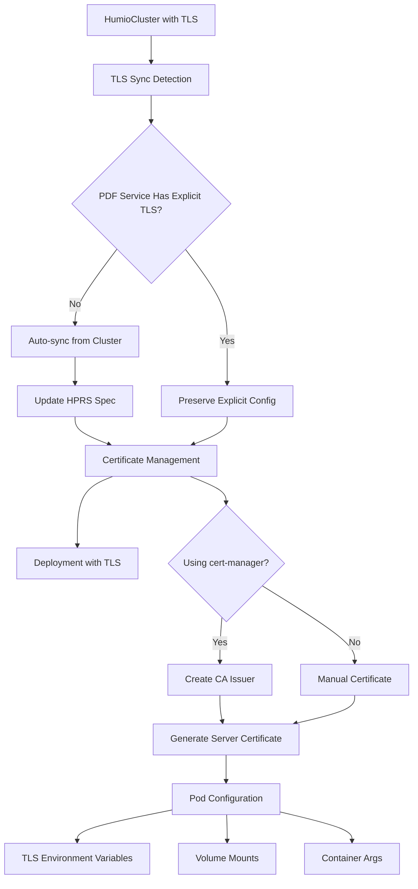
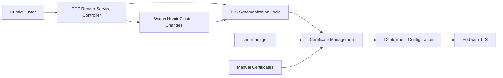

# PDF Render Service TLS Implementation Review

## Overview

This document provides a comprehensive review of the TLS implementation for the HumioPdfRenderService (HPRS) component in the Humio Operator, focusing on how TLS configuration is synchronized from HumioCluster and validated through comprehensive testing.

## Architecture

### TLS Configuration Flow



### Component Interaction



## TLS Configuration Components

### 1. TLS Specification Structure

The PDF Render Service uses a dedicated TLS specification:

```go
type HumioPdfRenderServiceTLSSpec struct {
    // Enabled toggles TLS on or off
    Enabled *bool `json:"enabled,omitempty"`
    // CASecretName is the name of the secret containing the CA certificate
    CASecretName string `json:"caSecretName,omitempty"`
    // ExtraHostnames is a list of additional hostnames to include in the certificate
    ExtraHostnames []string `json:"extraHostnames,omitempty"`
}
```

### 2. TLS Synchronization Logic

The controller implements intelligent TLS synchronization:

| Scenario | Behavior | Priority |
|----------|----------|----------|
| No explicit TLS config | Auto-sync from HumioCluster | Auto |
| Explicit TLS enabled/disabled | Preserve user setting | Manual |
| Multiple clusters with PDF | Use first TLS-enabled cluster | Auto |
| No TLS-enabled clusters | No synchronization | None |

### 3. Certificate Management

#### With cert-manager
- **CA Issuer**: Created automatically per PDF service
- **Server Certificate**: Generated with proper DNS names
- **Certificate Rotation**: Handled by cert-manager
- **Validation**: Checks certificate readiness

#### Without cert-manager
- **Manual Certificates**: Must be provided by user
- **CA Secret**: Generated or user-provided
- **Validation**: Ensures required keys exist

## TLS Environment Configuration

### Environment Variables
- `HUMIO_PDF_RENDER_USE_TLS=true`: Enables TLS mode

### Volume Mounts
- `/etc/tls/`: Server certificate and private key
- `/etc/ca/`: CA certificate for cluster communication

### Container Arguments
- `--tls-cert=/etc/tls/tls.crt`
- `--tls-key=/etc/tls/tls.key`
- `--ca-file=/etc/ca/ca.crt` (when using custom CA)

## Testing Strategy

### Test Categories

#### 1. TLS Synchronization Tests
- **Auto-sync from enabled cluster**: Verifies TLS inheritance
- **Explicit config preservation**: Ensures user settings are not overridden
- **Dynamic cluster updates**: Tests real-time TLS sync
- **Multiple cluster scenarios**: Validates prioritization logic

#### 2. Certificate Management Tests
- **cert-manager integration**: Certificate creation and readiness
- **Manual certificate validation**: Secret key validation
- **Certificate rotation**: Pod restart on cert changes
- **Error handling**: Missing certificates and timeouts

#### 3. Deployment Configuration Tests
- **Environment variables**: TLS flag configuration
- **Volume mounts**: Certificate mount validation
- **Container arguments**: TLS argument verification
- **Health probes**: HTTP vs HTTPS scheme selection

### Test Environment Considerations

#### cert-manager Availability
```go
// Different behaviors based on cert-manager presence
if helpers.UseCertManager() {
    // Use cert-manager for certificate management
    // Longer timeouts for certificate provisioning
} else {
    // Manual certificate creation for tests
    // Immediate validation of provided certificates
}
```

#### Timeout Handling
- **Standard environments**: 20-second certificate timeout
- **Test environments**: 60-second timeout for cert-manager
- **Certificate creation**: 90-second timeout in Kind clusters

## Key Implementation Details

### 1. TLS Enablement Logic

```go
func TLSEnabledForHPRS(hprs *humiov1alpha1.HumioPdfRenderService) bool {
    if hprs.Spec.TLS == nil {
        return UseCertManager()
    }
    if hprs.Spec.TLS.Enabled == nil {
        return UseCertManager()
    }
    // Respect explicit setting regardless of cert-manager status
    return *hprs.Spec.TLS.Enabled
}
```

### 2. Synchronization Conditions

```go
func shouldSynchronizeTLSFromCluster() bool {
    // Only sync if no explicit TLS configuration exists
    return hprs.Spec.TLS == nil || hprs.Spec.TLS.Enabled == nil
}
```

### 3. Certificate Validation

```go
func validateTLSConfiguration() error {
    // Skip validation if TLS explicitly disabled
    if hprs.Spec.TLS.Enabled != nil && !*hprs.Spec.TLS.Enabled {
        return nil
    }
    
    // Validate server certificate secret
    // Handle cert-manager processing delays
    // Return appropriate error states
}
```

## Controller Watchers

### HumioCluster Watching
```go
Watches(&humiov1alpha1.HumioCluster{}, handler.EnqueueRequestsFromMapFunc(
    func(ctx context.Context, obj client.Object) []reconcile.Request {
        // Only requeue PDF services without explicit TLS config
        // Allows automatic synchronization
    },
))
```

### Secret Watching
```go
Watches(&corev1.Secret{}, handler.EnqueueRequestsFromMapFunc(
    func(ctx context.Context, obj client.Object) []reconcile.Request {
        // Requeue when TLS secrets change
        // Enables certificate rotation
    },
))
```

## Error Handling and States

### State Transitions
- **Configuring**: During certificate provisioning or deployment updates
- **ConfigError**: Missing certificates, invalid TLS configuration
- **Running**: All components healthy and ready
- **ScaledDown**: Zero replicas configured

### Error Scenarios
1. **Missing Server Certificate**: Clear error message with secret name
2. **cert-manager Delays**: Transient state with requeue
3. **Invalid CA Configuration**: Configuration error state
4. **Certificate Timeout**: Error after reasonable wait period

## Security Considerations

### Certificate Management
- **Automatic Rotation**: Handled by cert-manager or manual process
- **Secure Defaults**: Proper file permissions (0440)
- **Key Separation**: Server certs and CA certs in separate volumes

### Network Security
- **TLS Termination**: At PDF render service level
- **Certificate Validation**: Proper hostname verification
- **Secure Communication**: With HumioCluster using CA certificates

## Best Practices and Recommendations

### 1. Configuration Management
- Use explicit TLS configuration for production environments
- Leverage automatic synchronization for development
- Monitor certificate expiration and renewal

### 2. Testing Guidelines
- Test both cert-manager and manual certificate scenarios
- Validate certificate rotation behavior
- Verify error handling and recovery

### 3. Operational Considerations
- Monitor PDF service TLS certificate status
- Ensure cert-manager health in production
- Plan for certificate backup and recovery

## Known Limitations and Future Enhancements

### Current Limitations
1. **Single Cluster Sync**: Only syncs from first TLS-enabled cluster
2. **Static Priority**: No configurable cluster prioritization
3. **Limited Hostname Control**: ExtraHostnames sync is basic

### Potential Improvements
1. **Multi-cluster TLS Policies**: Configurable sync behavior
2. **Certificate Lifecycle Events**: Better status reporting
3. **Advanced Hostname Management**: Dynamic DNS integration
4. **TLS Performance Monitoring**: Certificate health metrics

## Validation Checklist

### TLS Configuration
- [ ] TLS synchronization works correctly
- [ ] Explicit configuration is preserved
- [ ] Certificate management functions properly
- [ ] Error states are handled gracefully

### Testing Coverage
- [ ] Auto-sync scenarios tested
- [ ] Manual configuration scenarios tested
- [ ] Certificate lifecycle tested
- [ ] Error conditions tested

### Security Validation
- [ ] Certificates have proper permissions
- [ ] TLS communication is encrypted
- [ ] Certificate rotation works
- [ ] Error messages don't leak sensitive data